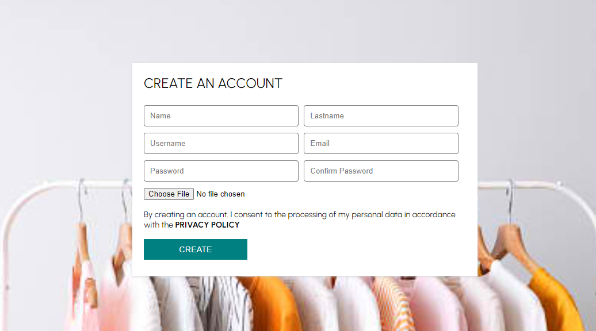
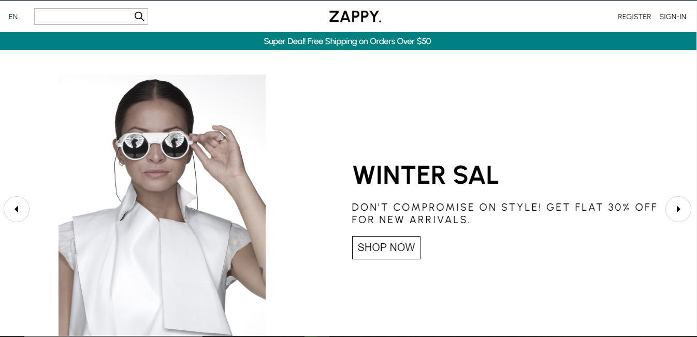
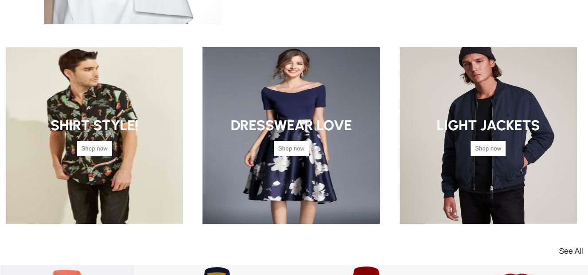
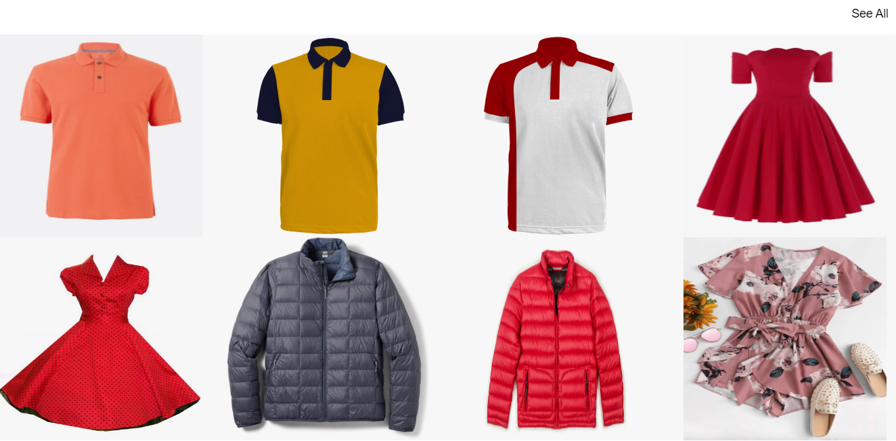
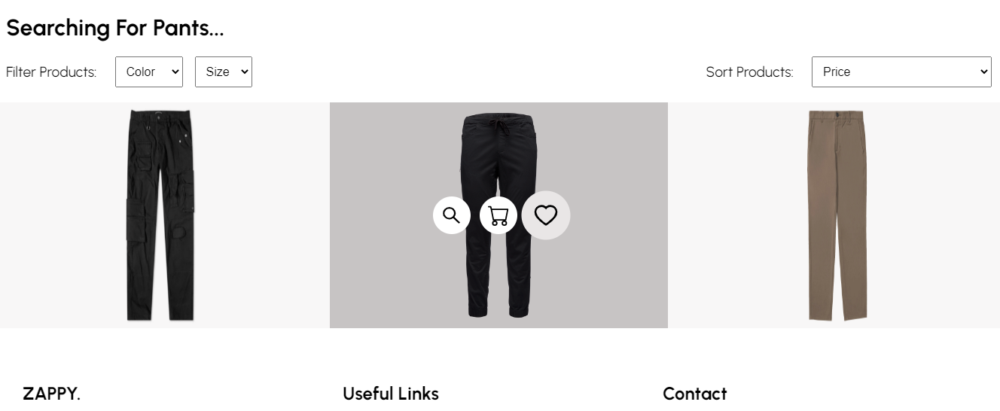
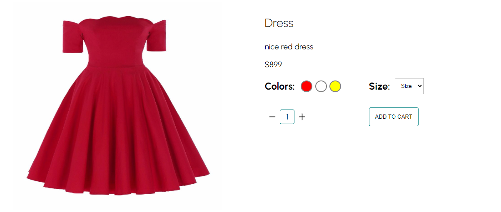
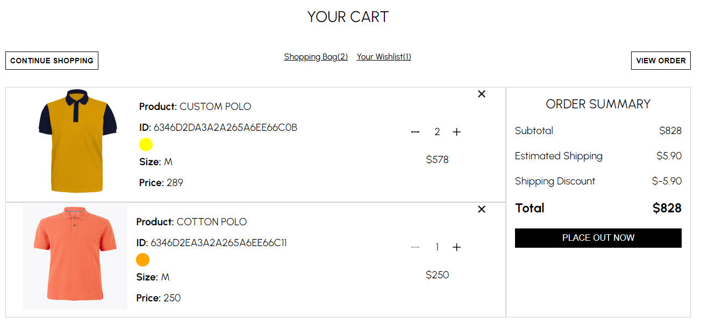
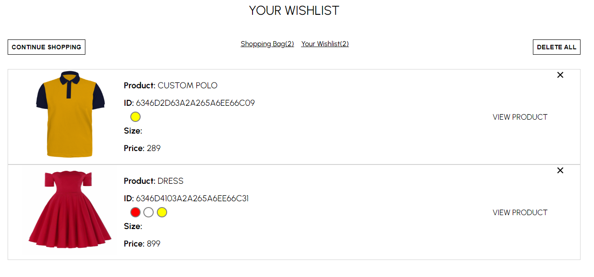
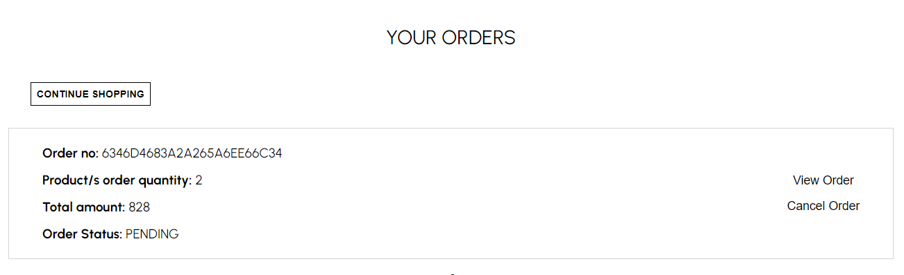
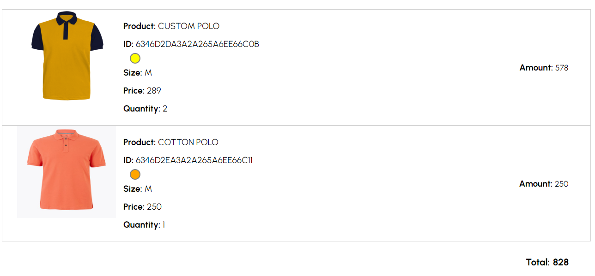

<h1 align="center"><a href='http://zappyfashion.herokuapp.com/' target='_blank' rel='noreferrer'>ZappyFashion</a></h1>

<h2 align="center">ZappyFashion is an online shopping for fashion.</h2>

## ⚒️ Built with the following technologies:

<ul>
    <li>React.js</li>
    <li>Node.js</li>
    <li>Express.js</li>
    <li>MongoDB</li>
    <li>Heroku 🚀</li>
</ul>

## ✨ Features

<ul>
    <li>Can add item into wishlist</li>
    <li>Can add item into cart</li>
    <li>Can choose the color and size of the item</li>
    <li>Can search item in searchbar</li>
</ul>

## 🖼️ Preview

<h3 align="center">Register</h3>
</img>
 
<h3 align="center">Homepage</h3>
</img>
 
<h3 align="center">Categories</h3>
</img>
 
<h3 align="center">Items</h3>
</img>
 
<h3 align="center">The user can choose where to view, add to cart, add to wishlist the item</h3>
</img>
 
<h3 align="center">The user can choose the color and size of the item</h3>
</img>
 
<h3 align="center">When an item/s was added to the cart</h3>
</img>
 
<h3 align="center">Items added to the wishlist</h3>
</img>
 
<h3 align="center">Orders</h3>
</img>
 
<h3 align="center">The user can view the order</h3>
</img>
 

